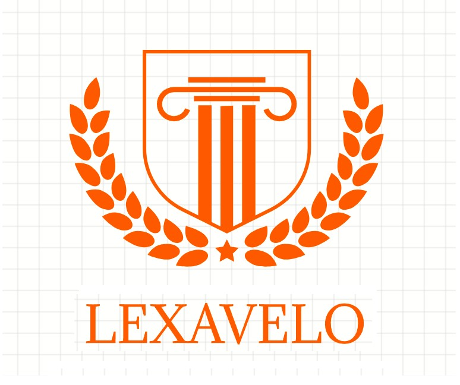

# Lexávelo

## Introduction
The [Léxavelo](https://youtube.com/@Lexavelo-language-commitee) project is a closed community where the creator spoke in an English-based cant. His long-term goal is to open this community and develop its identity around a fully fledged auxlang.

### People
The project is being run by Classicuscool. He is an Asian student and gamer who also speaks English and Spanish adequately.

## Alphabet
Lexávelo used the full Spanish alphabet, plus the rare letters Á and É. The accented Á of Lexávelo is to make the name unique.

## Grammar
The grammar of English was used, with the following known differences:

- Head-initial word order
- No grammatical gender
- Isolating bias
  - No closed compound words
  - No affixes

### Example: Tense
- Future: prepend the word "sera"
- Present: prepend the word "aola"
- Past: prepend the word "var"

## Vocabulary
There's no official vocabulary yet. Still, the creator has experimented with around 2000 unique words.
The vocabulary will be drawn from "Romance languages, Greek, Dutch, Swedish, and few Czech, and a bit Arabic, and etc.
